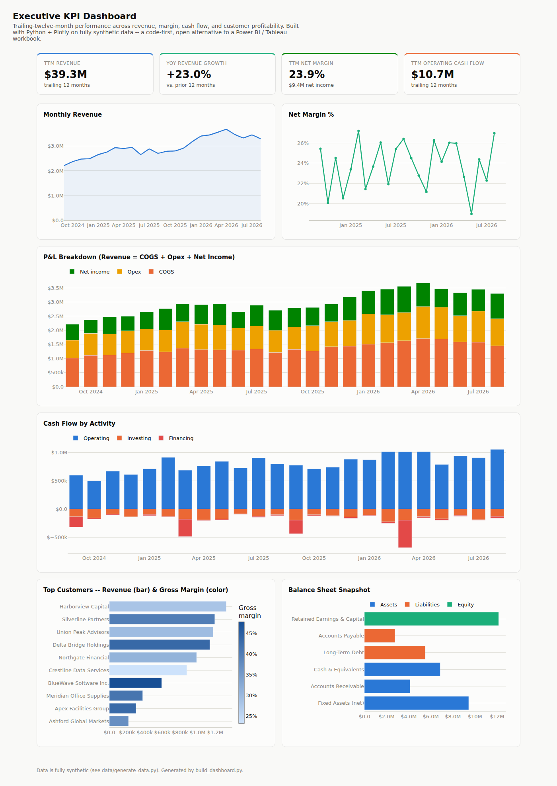

# Executive KPI Dashboard (Python + Plotly)

A self-contained, interactive executive KPI dashboard — revenue, margin,
cash flow, customer profitability, and a balance sheet snapshot — built as
a single HTML file with Python and Plotly.

This is a code-first, open alternative to a Power BI or Tableau workbook:
no BI license required to build or view it, fully versionable in git (the
whole dashboard is one diffable HTML file), and it opens in any browser
with no server. It maps directly to the resume's *"Reporting: P&L Analysis,
Cash Flow Statements, KPI Dashboards, Executive Presentations, Balance
Sheets"* and *"Analytics & Visualization... Power BI, Tableau"* lines.



## What's on it

- **KPI tiles** — trailing-twelve-month revenue, YoY revenue growth, net
  margin, and operating cash flow, each with its comparison period.
- **Monthly Revenue** and **Net Margin %** — two single-axis trend lines
  (deliberately kept as two charts rather than one dual-axis chart — see
  *Chart design choices* below).
- **P&L Breakdown** — a stacked monthly bar of COGS, Opex, and Net Income
  that sums back to revenue.
- **Cash Flow by Activity** — operating, investing, and financing cash flow
  per month.
- **Top Customers** — revenue by customer (bar length) with gross margin
  encoded as color, so both dimensions are visible without a second axis.
- **Balance Sheet Snapshot** — a point-in-time Assets / Liabilities / Equity
  breakdown.

Every chart has hover tooltips with exact figures; the underlying data is
also just CSV, so nothing here is a black box.

## Chart design choices

Built following a standard data-visualization discipline rather than
whatever a charting library defaults to:

- **No dual-axis charts.** Revenue and net margin % are different scales,
  so they're two single-axis charts side by side instead of one chart with
  two y-axes (a common but misleading pattern — a dual-axis chart lets you
  imply any correlation you want by rescaling one axis).
- **Fixed categorical color order** for multi-series charts (COGS/Opex/Net
  Income; Operating/Investing/Financing; Assets/Liabilities/Equity) so a
  color always means the same category across the whole dashboard.
- **Color encodes magnitude only where it's a true magnitude** — the
  customer chart's color scale is gross margin %, a continuous value, not a
  categorical label.
- **Hover tooltips on every series**, legends only where there's more than
  one series to distinguish.

## Run it

```bash
pip install -r requirements.txt

# 1. Generate the synthetic dataset (run once)
python data/generate_data.py

# 2. Build the dashboard
python build_dashboard.py
```

Then open `dashboard.html` in any browser. Regenerate with a different
threshold or point it at different data with `--data-dir` / `--output`.

## Data

Everything runs against **fully synthetic** data generated by
[`data/generate_data.py`](./data/generate_data.py) — 24 months of P&L and
cash flow, 10 sample customers, and a balanced point-in-time balance sheet.
This is not real company or client data.

## Repo structure

```
finance-kpi-dashboard/
├── data/
│   └── generate_data.py      # builds all synthetic input CSVs
├── build_dashboard.py        # builds dashboard.html from the CSVs
├── dashboard.html            # the dashboard itself (generated)
├── sample_output/
│   └── dashboard_preview.png # full-page screenshot for this README
├── requirements.txt
└── README.md
```

## Related projects

- [`financial-process-automation`](https://github.com/gooty1507/financial-process-automation) — AP/AR reconciliation, month-end close checks, budget variance detection
- [`financial-modeling-forecasting`](https://github.com/gooty1507/financial-modeling-forecasting) — DCF valuation, revenue forecasting

## Roadmap / ideas for extending this

- Add a date-range filter and a dimension filter (e.g. by profit center)
  that re-renders the charts client-side.
- Add a light/dark theme toggle (the CSS is already built on custom
  properties, so it's a `data-theme` attribute away).
- Wire `data/generate_data.py` to a real data source (a warehouse export,
  an SAP CO-PA extract) instead of synthetic CSVs.
